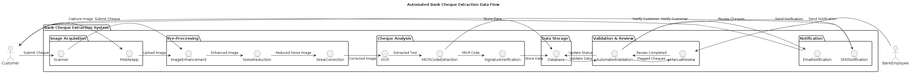

# 🏦 Automating Bank Cheque Extraction from Scanned PDFs

This project was developed as part of my **Python Developer Internship at Infosys Springboard**, where I focused on building intelligent automation tools using OCR and image processing. Titled **“Automatic Cheque Extraction from Scanned Document”**, this project aims to streamline the manual effort of extracting financial data from scanned bank cheques, using a combination of PDF processing, computer vision, and text recognition.

---

## 🎯 Project Objective

To build a Python-based application that accepts scanned PDF cheques, extracts textual information such as account numbers, IFSC codes, and cheque amounts using OCR, and stores them securely in a local database for efficient retrieval and processing.

---

## 💡 Key Highlights

- 🔄 **PDF to Image Conversion** – Convert scanned PDFs into images for processing  
- 🧹 **Image Preprocessing with OpenCV** – Denoising and thresholding for OCR accuracy  
- 🔎 **Text Extraction with Tesseract OCR** – Extract key cheque details like account number, date, and amount  
- 🗃️ **Data Storage using SQLite3** – Securely store extracted text for reporting and integration  
- 🖥️ **GUI with Tkinter** – Simple, interactive interface for non-technical users

---

## 🛠️ Tech Stack

| Technology | Purpose                         |
|------------|----------------------------------|
| Python     | Core programming language        |
| pdf2image  | Convert PDFs into image format   |
| OpenCV     | Image enhancement and filtering  |
| Pytesseract| Optical Character Recognition    |
| SQLite3    | Local database for data storage  |
| Tkinter    | GUI for user interaction         |

---

## 📌 Application Flow

1. User uploads a scanned cheque in PDF format  
2. PDF is converted into image format  
3. Image is preprocessed to remove noise and improve OCR quality  
4. Pytesseract extracts key textual information  
5. Extracted data is stored in SQLite3  
6. The GUI displays results and confirms successful processing

---

## 🔁 Workflow Diagram

---

## 🧠 Real-World Applications

- Automated cheque data entry in banks
- Bulk document digitization in accounting firms
- Preprocessing stage for fraud detection systems
- Financial records automation in ERP solutions

---
